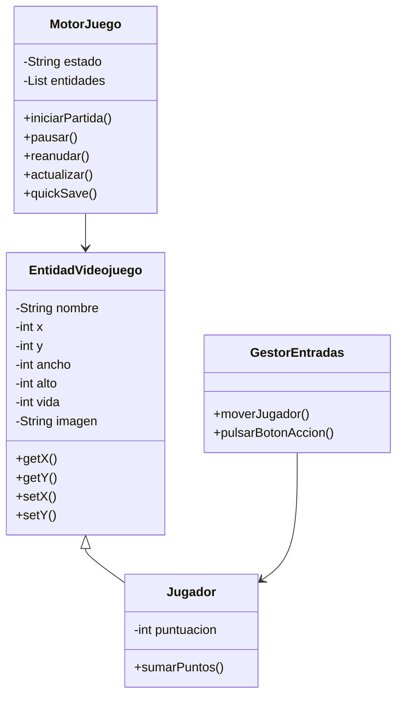

```mermaid
classDiagram

class EntidadVideojuego{
-String nombre
-int x
-int y
-int ancho
-int alto
-int vida
-String imagen
+getX()
+getY()
+setX()
+setY()
}

class Jugador{
-int puntuacion
+sumarPuntos()
}

class MotorJuego{
-String estado
-List entidades
+iniciarPartida()
+pausar()
+reanudar()
+actualizar()
+quickSave()
}

class GestorEntradas{
+moverJugador()
+pulsarBotonAccion()
}

EntidadVideojuego <|-- Jugador
MotorJuego --> EntidadVideojuego
GestorEntradas --> Jugador
```